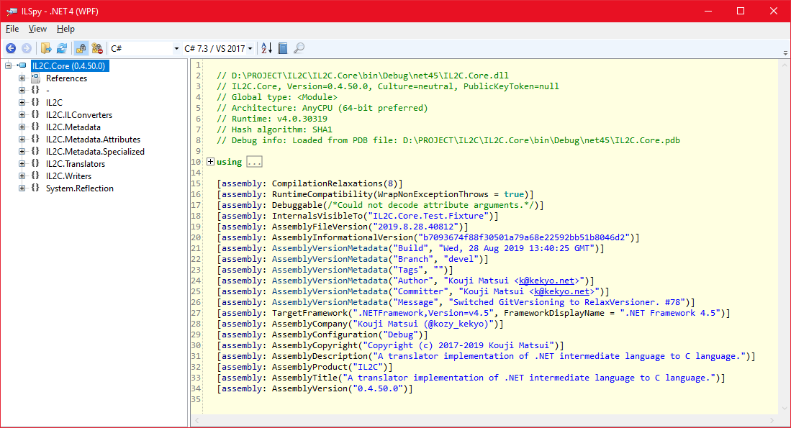

# RelaxVersioner


[English language is here](https://github.com/kekyo/CenterCLR.RelaxVersioner)

# Status

[](https://www.repostatus.org/#active)

| | master | devel |
|:---|:---|:---|
| Packages | [](https://www.nuget.org/packages/RelaxVersioner) | [](https://www.myget.org/feed/kekyo/package/nuget/RelaxVersioner)
| Continuous integration | [](https://github.com/kekyo/CenterCLR.RelaxVersioner/actions) | [](https://github.com/kekyo/CenterCLR.RelaxVersioner/actions)

## これは何？

* RelaxVersionerは、軽量で簡単に使用することが出来る、Gitベースの「自動バージョニング」ツールセットです。.NET 6.0/5.0/.NET Core/.NET Frameworkベースのソースコードを対象としていて、ビルド時にアセンブリ属性を自動的に適用します。
* RelaxVersionerのNuGetパッケージをインストールするだけで、Gitのタグ・ブランチ・コミットメッセージだけを使って、バージョン管理が出来ます。つまり、追加のツール操作が不要なため、Gitさえ知っていれば学習コストがほとんどなく、CI環境にも容易に対応できます。
* サポートしている言語と環境は、以下の通りです（恐らく、現在のほとんどの.NET開発環境に適合します）:
  * C#・F#・VB.NET・C++/CLI、そしてNuGetパッケージング (dotnet cli packコマンド)
  * Visual Studio 2022/2019/2017/2015, Rider, dotnet SDK cli, `net6.0`, `net5.0`, `netcoreapp3.1`, `netcoreapp2.2` 及び `net461` 以上の元で動作するMSBuild環境 (注: MSBuildの動作プラットフォームの事です、あなたがターゲットにしたいプロジェクトの事ではありません)、及びこれらを使用する任意のIDE。
  * Linux(x64)及びWindows(x86/x64)  （検証している環境は先のとおりですが、[libgit2sharp](https://github.com/libgit2/libgit2sharp)の動作要件に準じて動作する可能性があります）
* ローカルのGitリポジトリから、自動的にタグ・ブランチの名称を取得し、アセンブリ属性に適用することが出来ます。
* AssemblyInfo.csファイルを直接変更しません。RelaxVersionerはテンポラリファイルに定義を出力し、それをコンパイルさせます。
* Visual Studio/MSBuildの中間出力フォルダーを自動的に使用するため、Gitリポジトリ内を汚すことがありません。
* カスタムルールセットを定義することで、出力する属性と内容をカスタマイズすることが出来ます。

### バージョン情報が埋め込まれた、Explorerで見るアセンブリのプロパティ


### バージョン情報が埋め込まれた、ILSpyで見るアセンブリの属性群



----

## 出力されるコードの例:

### For C#:

``` csharp
using System.Reflection;
[assembly: AssemblyVersion("1.0.21")]
[assembly: AssemblyFileVersion("2020.12.20.33529")]
[assembly: AssemblyInformationalVersion("1.0.21-561387e2f6dc90046f56ef4c3ac501aad0d5ec0a")]
[assembly: AssemblyMetadata("Date","Sun, 20 Dec 2020 09:37:39 GMT")]
[assembly: AssemblyMetadata("Branch","master")]
[assembly: AssemblyMetadata("Tags","")]
[assembly: AssemblyMetadata("Author","Kouji Matsui <k@kekyo.net>")]
[assembly: AssemblyMetadata("Committer","Kouji Matsui <k@kekyo.net>")]
[assembly: AssemblyMetadata("Message","Merge branch 'devel'")]
[assembly: AssemblyMetadata("Build","")]
[assembly: AssemblyMetadata("Generated","Sun, 20 Dec 2020 09:37:43 GMT")]
[assembly: AssemblyMetadata("Platform","AnyCPU")]
[assembly: AssemblyMetadata("BuildOn","Unix")]
[assembly: AssemblyMetadata("SdkVersion","5.0.101")]

namespace YourApp
{
  internal static class ThisAssembly
  {
    public const string AssemblyVersion = "1.0.21";
    public const string AssemblyFileVersion = "2020.12.20.33529";
    public const string AssemblyInformationalVersion = "1.0.21-561387e2f6dc90046f56ef4c3ac501aad0d5ec0a";
    public static class AssemblyMetadata
    {
      public const string Date = "Sun, 20 Dec 2020 09:37:39 GMT";
      public const string Branch = "master";
      public const string Tags = "";
      public const string Author = "Kouji Matsui <k@kekyo.net>";
      public const string Committer = "Kouji Matsui <k@kekyo.net>";
      public const string Message = "Merge branch 'devel'";
      public const string Build = "";
      public const string Generated = "Sun, 20 Dec 2020 09:37:43 GMT";
      public const string Platform = "AnyCPU";
      public const string BuildOn = "Unix";
      public const string SdkVersion = "5.0.101";
    }
  }
}
```

### For F#:

``` fsharp
namespace global
  open System.Reflection
  [<assembly: AssemblyVersion("1.0.21")>]
  [<assembly: AssemblyFileVersion("2020.12.20.33529")>]
  [<assembly: AssemblyInformationalVersion("1.0.21-561387e2f6dc90046f56ef4c3ac501aad0d5ec0a")>]
  [<assembly: AssemblyMetadata("Date","Sun, 20 Dec 2020 09:37:39 GMT")>]
  [<assembly: AssemblyMetadata("Branch","master")>]
  [<assembly: AssemblyMetadata("Tags","")>]
  [<assembly: AssemblyMetadata("Author","Kouji Matsui <k@kekyo.net>")>]
  [<assembly: AssemblyMetadata("Committer","Kouji Matsui <k@kekyo.net>")>]
  [<assembly: AssemblyMetadata("Message","Merge branch 'devel'")>]
  [<assembly: AssemblyMetadata("Build","")>]
  [<assembly: AssemblyMetadata("Generated","Sun, 20 Dec 2020 09:38:33 GMT")>]
  [<assembly: AssemblyMetadata("Platform","AnyCPU")>]
  [<assembly: AssemblyMetadata("BuildOn","Unix")>]
  [<assembly: AssemblyMetadata("SdkVersion","5.0.101")>]
  do()

namespace global
  module internal ThisAssembly =
    [<Literal>]
    let AssemblyVersion = "1.0.21";
    [<Literal>]
    let AssemblyFileVersion = "2020.12.20.33529";
    [<Literal>]
    let AssemblyInformationalVersion = "1.0.21-561387e2f6dc90046f56ef4c3ac501aad0d5ec0a";
    module AssemblyMetadata =
      [<Literal>]
      let Date = "Sun, 20 Dec 2020 09:37:39 GMT";
      [<Literal>]
      let Branch = "master";
      [<Literal>]
      let Tags = "";
      [<Literal>]
      let Author = "Kouji Matsui <k@kekyo.net>";
      [<Literal>]
      let Committer = "Kouji Matsui <k@kekyo.net>";
      [<Literal>]
      let Message = "Merge branch 'devel'";
      [<Literal>]
      let Build = "";
      [<Literal>]
      let Generated = "Sun, 20 Dec 2020 09:38:33 GMT";
      [<Literal>]
      let Platform = "AnyCPU";
      [<Literal>]
      let BuildOn = "Unix";
      [<Literal>]
      let SdkVersion = "5.0.101";
  do()
```

## RelaxVersionerの使い方

### 解説動画があります (YouTube):

[](https://www.youtube.com/watch?v=qJ84sXT-dxI)

### スタートガイド

* [An easy way to practice version embedding on .NET (英語/dev.to)](https://dev.to/kozy_kekyo/an-easy-way-to-practice-version-embedding-on-net-45h8)
* [Refer start guides. (英語)](./STARTGUIDE.md)

### 簡単な使い方

* NuGetで["RelaxVersioner"](https://www.nuget.org/packages/RelaxVersioner/)を検索して、導入してください。
* (.NET Coreではない旧形式のMSBuildプロジェクトを使っている場合): あらかじめ、AssemblyInfo.cs等に定義されている、デフォルトの"AssemblyVersion"と"AssemblyFileVersion"属性をコメントアウトして下さい（ビルド時に重複定義エラーが発生します）。
  * これらはカスタムルールを用いて定義を除外するのであれば、引き続き使用する事もできます。
* ビルドすると、自動的にアセンブリ属性が適用されます。[ILSpy](https://github.com/icsharpcode/ILSpy)等で確認するか、一部の属性はエクスプローラーのプロパティから確認することが出来ます。
* プロジェクトフォルダ、又はソリューションフォルダに"RelaxVersioner.rules"ファイルを配置することで、カスタムルールを定義出来ます。カスタムルールファイルの定義例を参照してください。

### 開発運用の例

1. C#・F#などでプロジェクトを新規に作ります。
2. NuGetで"RelaxVersioner"を検索して、プロジェクトに追加します。
3. (オプション): AssemblyInfo.csなどに定義されている、デフォルトの"AssemblyVersion"と"AssemblyFileVersion"属性をコメントアウトします。
4. この状態でビルドするだけで、バージョンが適用されたバイナリが生成されます。
  * デフォルトでは、AssemblyVersionが"0.0.1.0"、AssemblyFileVersionがビルド時の日時を2秒精度でバージョン化した値（例:"2016.05.12.11523"）となります。
  * また、AssemblyVersionMetadataに、ローカルGitリポジトリから得られる情報が埋め込まれます（Author・ブランチ・タグなど）。しかし、この例ではまだgit initしてないので"Unknown"として埋め込まれます。
5. ソリューションフォルダでgit initして適当にコミットしてください。
6. この状態でビルドすると、Author・ブランチやコミットメッセージが埋め込まれます。
7. 現在のコミットにタグをつけてください。例えば"0.5.4"や"v0.5.4"のようなバージョン表記です。これでビルドすれば、このバージョン番号が自動的にAssemblyVersionに反映されるようになります。
  * 自動バージョンインクリメント機能: 現在のコミットにタグが無い場合は、過去のコミットに辿っていって、最初に見つかった有効なタグからのコミット数に応じて、バージョンの末尾が自動的にインクリメントされます。例えば、2つ祖先のコミットに"0.5.4"というタグが付いていた場合、自動的に計算されるバージョンは"0.5.6"になります。
  * コミットの分岐がマージされている場合は、プライマリ分岐を優先して探索します。つまり、ブランチ運用をしている場合は、ブランチを切った際に、それぞれにタグをつけておくことで、異なるブランチで異なる自動バージョンインクリメントの法則を適用できます。例えば、masterブランチに"1.0.0"、develブランチに"1.1.0"と、タグを適用することで、チックタックモデルを実現できます。
8. 全て良ければ、リモートリポジトリにpushして完了です。
9. 以後、コードを変更してリリースの準備が出来たら、新たにタグをつければそれがAssemblyVersionに反映されるので、ビルドしてバイナリをリリースします。
  * dotnet cliを使用してNuGetのパッケージをビルドする場合にも、`PackageVersion`と`PackageReleaseNotes`は自動的に適用されます。完成してデプロイする場合は、`dotnet pack`コマンドを使えば、NuGetのバージョンを一元管理できます。

----

## ヒントや参考情報

### ビルド後にバージョン番号を使用する方法

RelaxVersionerは、ビルド後に、以下の位置にファイルを保存します:

```
<your project dir>/obj/<configuration>/<tfm>/
```

正確には:

* ビルド時は`$(IntermediateOutputPath)`です。
* NuGetパッケージ生成時は`$(NuspecOutputPath)`です。

例えば、`FooBarProject/obj/Debug/net6.0/` のようなディレクトリ階層です。以下に保存するファイルを示します:

* `RelaxVersioner.cs` : バージョン属性や`ThisAssembly`クラスの定義を含む、ソースコードです。RelaxVersionerの中心的な役割を果たします。
* `RelaxVersioner_Properties.xml` : RelaxVersionerがバージョン計算を行う直前の、MSBuildの全てのプロパティを、XML形式でダンプしたものです。
* `RelaxVersioner_Result.xml` : RelaxVersionerがバージョン計算を行った後の、主要なバージョン情報をXML形式でダンプしたものです。
* `RelaxVersioner_Version.txt` : RelaxVersionerがバージョン計算を行った後の、バージョン番号のみをテキスト形式で保存したものです。
* `RelaxVersioner_ShortVersion.txt` : RelaxVersionerがバージョン計算を行った後の、短いバージョン番号のみをテキスト形式で保存したものです。
* `RelaxVersioner_SafeVersion.txt` : RelaxVersionerがバージョン計算を行った後の、安全な日時バージョン番号のみをテキスト形式で保存したものです。
* `RelaxVersioner_Branch.txt` : RelaxVersionerがバージョン計算を行った時の、チェックアウトブランチ名をテキスト形式で保存したものです。
* `RelaxVersioner_Tags.txt` : RelaxVersionerがバージョン計算を行った時の、コミットに対応するタグ群をテキスト形式で保存したものです。

プログラムの内部からバージョン情報を参照する場合は、バージョン属性や`ThisAssembly`から取得すれば良いでしょう。
他の、XMLやテキストファイルは、CI/CD（継続インテグレーションや継続デプロイ）で参照する事で、
ビルドプロセスにバージョン情報を適用する事が出来ます。
例えば、`RelaxVersioner_ShortVersion.txt`には、`2.5.4`のような文字列が格納されているので、
ビルド成果物をサーバーにアップロードする際に、バージョン番号をファイル名に追加して保存する事が出来るかもしれません。

これらの情報をMSBuildターゲット内から参照する場合は、テキストファイルにアクセスすることなく、以下のようにプロパティを使用できます:

```xml
  <Target Name="AB" AfterTargets="Compile">
    <Message Importance="High" Text="PropertiesPath: $(RelaxVersionerPropertiesPath)" />
    <Message Importance="High" Text="ResultPath: $(RelaxVersionerResultPath)" />
    <Message Importance="High" Text="ResolvedVersion: $(RelaxVersionerResolvedVersion)" />
    <Message Importance="High" Text="ResolvedShortVersion: $(RelaxVersionerResolvedShortVersion)" />
    <Message Importance="High" Text="ResolvedSafeVersion: $(RelaxVersionerResolvedSafeVersion)" />
    <Message Importance="High" Text="ResolvedCommitId: $(RelaxVersionerResolvedCommitId)" />
    <Message Importance="High" Text="ResolvedBranch: $(RelaxVersionerResolvedBranch)" />
    <Message Importance="High" Text="ResolvedTags: $(RelaxVersionerResolvedTags)" />
  </Target>
```

`RelaxVersioner_Properties.xml`には、非常に有用な、多くの情報が格納されています。
MSBuildのカスタムスクリプトを書かなくても、このXMLファイルから情報を引き出すだけで、
細かなニーズを満たせられるかもしれません。

### SourceLinkに対応させる方法

[Sourcelink](https://github.com/dotnet/sourcelink) は、
Gitソースコードリポジトリからオンザフライでダウンロードしたソースコードをデバッガーに表示するための、統合パッケージです。

この機能を使うと、パッケージを使用するコードのデバッグ中に、
（事前の準備なしに）パッケージ内にステップインして、ソースコードデバッグする事が出来るようになります。

RelaxVersionerはすでにSourcelink統合をサポートしています。
簡単な手順で、Sourcelinkに対応させる事が出来ます:

```xml
<!-- Sourcelink統合で定義する共通プロパティ -->
<PropertyGroup>
  <!-- プロジェクトで参照されないソースコードの情報を含める -->
  <EmbedUntrackedSources>true</EmbedUntrackedSources>

  <!-- シンボルの情報をアセンブリ内に含める（推奨） -->
  <DebugType>embedded</DebugType>

  <!-- または、以下のような指定でシンボル (*.pdb) をパッケージに取り込む -->
  <!-- <DebugType>portable</DebugType> -->
  <!-- <AllowedOutputExtensionsInPackageBuildOutputFolder>.pdb</AllowedOutputExtensionsInPackageBuildOutputFolder> -->

  <!-- Gitリポジトリの情報（必須） -->
  <PublishRepositoryUrl>true</PublishRepositoryUrl>
  <RepositoryType>git</RepositoryType>
  <RepositoryUrl>https://github.com/kekyo/Epoxy.git</RepositoryUrl>
</PropertyGroup>

<!-- GitHub CI Releaseビルド時に、安定したバイナリを生成 -->
<!-- （まったく同じソースコードからはまったく同じバイナリが生成される） -->
<PropertyGroup Condition="'$(Configuration)' == 'Release'">
  <Deterministic>true</Deterministic>
  <ContinuousIntegrationBuild>true</ContinuousIntegrationBuild>
</PropertyGroup>

<ItemGroup>
  <!-- RelaxVersioner -->
  <PackageReference Include="RelaxVersioner" Version="2.12.0" PrivateAssets="All" />

  <!-- ソリューションファイルが存在する場合の、ルートディレクトリ位置 -->
  <!-- 参照: https://github.com/dotnet/roslyn/issues/37379 -->
  <SourceRoot Include="$(MSBuildThisFileDirectory)/"/>
</ItemGroup>

<!-- Sourcelink GitHubパッケージを追加 -->
<ItemGroup Condition="'$(Configuration)' == 'Release'">
  <PackageReference Include="Microsoft.SourceLink.GitHub" Version="1.1.1" PrivateAssets="All" />
</ItemGroup>
```

より詳しい情報は、[Sourcelinkのドキュメントを参照してください。](https://github.com/dotnet/sourcelink/blob/main/docs/README.md)

### Gitのコミット検索でエラーが発生する

もしCIプロセスで使ったときに、以下のようなエラーが発生した場合:

```
RelaxVersioner [2.12.0]: NotFoundException=object not found -
   no match for id (a2b834535c00e7b1a604fccc28cfebe78ea0ec31),
   Unknown exception occurred, ...
```

これは、CIプロセスのワークスペースにリポジトリをcloneした際に、
最も新しいコミットだけをcloneしてきたために(検索するコミットが見つからないため)発生します。
常に全てのコミットをcloneする必要があります。

例えば、GitHub Actionsの `checkout@v2` タスクは、デフォルトで常に最新のコミットだけをcloneします。
何故なら、それが最も高速に処理できるからです。

RelaxVersioner (や、その他の自動バージョニングツール) は、
正しいバージョン番号を計算するために、全てのコミットを必要とします。

そのため、build.yml (GitHub Actionsのスクリプト) に、
`fetch-depth: 0` を追加して下さい。
[このリポジトリで実際に使用している例を参照できます。](https://github.com/kekyo/CenterCLR.RelaxVersioner/blob/master/.github/workflows/build.yml#L11)

### NuGetパッケージ生成にnuspecファイルを使用する

nuspecファイルを使ってパッケージを生成する場合は、デフォルトのプレースホルダ以外にも使用可能なシンボルがあります。この機能により、nuspecファイルを使用してNuGetパッケージを生成する場合でも、生成を自動化出来ます。以下の例を参考にして下さい:

```xml
<package xmlns="http://schemas.microsoft.com/packaging/2010/07/nuspec.xsd">
  <metadata>
    <!-- パッケージバージョンの埋め込み -->
    <version>$PackageVersion$</version>

    <!-- ブランチ名とコミットIDの埋め込み -->
    <repository type="git" url="https://example.com/your/repo.git" branch="$RepositoryBranch$" commit="$RepositoryCommit$" />

    <!-- コミットメッセージの埋め込み -->
    <releaseNotes>$PackageReleaseNotes$</releaseNotes>
  </metadata>
</package>
```

* 用意したnuspecファイルをプロジェクトに追加して、`PropertyGroup`の`NuSpecFile`プロパティで指定します。後の手順は、一般的なNuGetパッケージングの手順と同じです。

----

## その他

* RelaxVersionerをVisual Studio 2012/2013で使うには、システムに.NET Framework 4.6以上がインストールされている必要があります。RelaxVersionerは、MSBuild.Frameworkアセンブリのnet46以上のバージョンを必要とするためです。

----

## カスタムルールファイル(RelaxVersioner.rules)の例:

``` xml
<?xml version="1.0" encoding="utf-8"?>
<RelaxVersioner version="1.0">
  <WriterRules>
    <!-- この定義を適用する言語です。 -->
    <Language>C#</Language>
    <Language>F#</Language>
    <Language>VB</Language>
    <Language>C++/CLI</Language>
    
    <Import>System.Reflection</Import>
    
    <!--
      "versionLabel" は、ドットで区切られたバージョン番号を、gitリポジトリのタグを検索して埋め込みます。
      タグの形式は、 [1.2.3.4] や [v1.2.3.4] のような形式です。
      タグが見つからない場合は、 [0.0.1] を使用します。
    -->
    <Rule name="AssemblyVersion">{versionLabel}</Rule>
    
    <!--
      "safeVersion" は、現在のコミットの日時（コミットした人）を埋め込みます。
      "safeVersion" は、 "committer.When" と書くのと同じです。
      （日時のフォーマットは、バージョン番号として許容される形式に従い、 [2016.2.14.12345] のような、最小2秒精度の一意な文字列となります。）
    -->
    <Rule name="AssemblyFileVersion">{safeVersion}</Rule>
    
    <!--
      "commitId" は、現在のコミットのID（gitのコミットID、つまりはハッシュ値）を埋め込みます。
      "commitId" は、 "commit.Sha" と書くのと同じです。
    -->
    <Rule name="AssemblyInformationalVersion">{versionLabel}-{commitId}</Rule>
    
    <!--
      "key" 属性は、通常は、 "AssemblyMetadataAttribute" 属性にのみ適用出来ます。
      日付を埋め込みたい場合は、 "committer.When" や "author.When" と言った指定を使えます。
      "branch" は、 "FriendlyName" や "CanonicalName" といったプロパティ名を繋げて使うことが出来ます。
      これらは、 libgit2sharp の Branch クラスの定義に従います。
      "author" と "committer" は、 "Name" や "Email" や "When" と言ったプロパティ名を使用出来ます。
      "buildIdentifier" は、 MSBuild の PropertyGroup で定義された "RelaxVersionerBuildIdentifier" 又は "BuildIdentifier" に相当します。
      これは、 GitHub Actions などの CI 環境で、ビルド毎に適用されるビルド番号を埋め込むのに使います。
      "generated" は RelaxVersioner が定義を生成した日時です。
      対象のプロパティが文字列ではない場合は、string.Format() と同様に、書式指定を加えることが出来ます。
    -->
    <Rule name="AssemblyMetadata" key="Date">{committer.When:R}</Rule>
    <Rule name="AssemblyMetadata" key="Branch">{branch.FriendlyName}</Rule>
    <Rule name="AssemblyMetadata" key="Tags">{tags}</Rule>
    <Rule name="AssemblyMetadata" key="Author">{author}</Rule>
    <Rule name="AssemblyMetadata" key="Committer">{committer}</Rule>
    <Rule name="AssemblyMetadata" key="Message">{commit.MessageShort}</Rule>
    <Rule name="AssemblyMetadata" key="Build">{buildIdentifier}</Rule>
    <Rule name="AssemblyMetadata" key="Generated">{generated:R}</Rule>
    
    <!-- 以下の定義はデフォルトでは含まれていませんが、有効にすることで使用出来ます。
    <Rule name="AssemblyMetadata" key="TargetFrameworkIdentity">{tfid}</Rule>
    <Rule name="AssemblyMetadata" key="TargetFrameworkVersion">{tfv}</Rule>
    <Rule name="AssemblyMetadata" key="TargetFrameworkProfile">{tfp}</Rule>
    -->
    
    <!--
      "Platform" は、 MSBuild の PropertyGroup で定義されている値です。
      その他の PropertyGroup のキー名や、環境変数から取り込まれた値を、そのまま使用することが出来ます。
      例えば、 "RootNamespace" や "Prefer32Bit" や "NETCoreSdkVersion" や "PATH" などです。
      これらの値は、全て文字列として参照されます。従って、フォーマットの書式指定は無視されます。
    -->
    <Rule name="AssemblyMetadata" key="Platform">{Platform}</Rule>
    <Rule name="AssemblyMetadata" key="BuildOn">{OS}</Rule>
    <Rule name="AssemblyMetadata" key="SdkVersion">{NETCoreSdkVersion}</Rule>

    <!-- 以下の定義はデフォルトでは含まれていませんが、有効にすることで使用出来ます。
    <Rule name="AssemblyMetadata" key="Language">{Language}</Rule>
    <Rule name="AssemblyMetadata" key="HostName">{COMPUTERNAME}</Rule>
    -->
  </WriterRules>
</RelaxVersioner>
```

----

## TODO:

* 除外ルールのサポート
* ネイティブC++プロジェクトに対応させる
* テンプレート出力をサポートする
* フォールバックルールを指定可能にする

## License

* Copyright (c) Kouji Matsui (@kozy_kekyo, @kekyo@mastodon.cloud)
* Under Apache v2

----

## 履歴

* 2.13.1:
  * `AssemblyConfiguration`のスタティック定義名に`Attribute`が含まれていたのを修正。
  * (RelaxVersioner自身の)SourceLinkの基底位置が誤っていたのを修正。RelaxVersionerを使って生成したプロジェクトに影響はありません。
* 2.13.0:
  * 古いプロジェクトフォーマットでの擬似 tfm をサポートしました。
  * より使いやすいアセンブリ構成メタデータを追加しました。
* 2.12.1:
  * バージョンの結果テキストファイルを拡充しました。
    `RelaxVersioner_SafeVersion.txt`, `RelaxVersioner_Branch.txt`, `RelaxVersioner_Tags.txt`に関する結果を使用できます。
  * バージョンの結果テキストファイルに改行コードが入らないようにしました。
  * ビルド直後のMSBuildプロパティ`Version`に、`ShortVersion`をフォールバック代入するようにしました。
    `Version`プロパティを使用する、後続のMSBuildスクリプトでも、安全に認識されたバージョン番号を使用できます。
* 2.11.0:
  * NuGetパッケージ生成時に、入力となるソースコードが存在しないプロジェクトでエラーが発生する問題を修正しました。
* 2.10.0:
  * プロジェクト参照したプロジェクトのターゲットで、パッケージのバージョンが更新されない問題を修正しました。
* 2.9.0:
  * 出力が生成されないプロジェクトで、XMLファイルの読み取りエラーが発生する問題を修正しました。
* 2.8.0:
  * 外部で流用可能な、バージョンのみを格納したテキストファイルを出力するようにしました。
  * ビルドタイミングを調整して、Intellisenseが`ThisAssembly`クラスを認識できない事がある問題を修正しました。
  * NuGetパッケージビルド時に、ビルドが実行されない場合がある問題を修正しました。
* 2.7.0:
  * ビルド時のファイル依存関係ルールを定義し、不要なビルドを避けるようにしました。
* 2.6.0:
  * クリーンビルドの安定性を向上させました。
  * `netcoreapp2.0`, `2.1`, `netcoreapp3.0` の開発環境を非対応としました。
    これらのSDKを使用している場合は、それぞれ、最新のSDKにアップデートして下さい。
  * 現在の`TargetFramework`名称のバナーを表示するようにしました。
* 2.5.5:
  * 暗黙に.NET Core 2.0の動作環境が必要とされていた問題を修正。
* 2.5.2:
  * .NET 6環境で、デフォルトの追加属性群が適用されていなかった問題を修正。
* 2.5.1:
  * シンボル`BundledNETCoreAppTargetFrameworkVersion`が定義されていないとして発生するエラーを修正。
* 2.5.0:
  * VS2022にアップグレード (プロジェクトに変更はありません)
  * .NET5/6において、ビルド時のランタイムバージョン検出を修正。
* 2.4.0:
  * .NET 6.0 SDKをサポート。
* 2.3.2:
  * VisualStudio for Mac上で使用した場合に、LibGit2SharpExceptionが発生する問題を修正。
* 2.3.0:
  * .NET SDK3.1又は5.0のみをインストールした環境で実行時エラーが発生する問題を修正。
* 2.2.0:
  * Sourcelink属性をサポート (AssemblyInformationalVersionの形式と、NuGetパッケージ属性)
* 2.1.0:
  * MSBuild で定義される多くの PropertyGroups の値をそのまま使えるようにしました。MSBuildだけでは、これらの値を参照するのはかなり手間でしたが、ルールファイルにプロパティ名を指定するだけで、値を同じように埋め込むことが出来ます（具体的な例は、カスタムルールファイルの章を参照）
* 2.0.9:
  * net461バイナリで、ValueTupleアセンブリの互換性問題が発生していたのを修正。
* 2.0.8:
  * 一度もタグ付けされていないリポジトリで、誤ったdepthを計算することがあるのを修正。
* 2.0.5:
  * C#でnet40-clientを使用する場合に、AssemblyMetadataAttributeクラスの重複ウォーニングが発生していたのを修正。
* 2.0.0:
  * 2.0公開 🎉
  * .NET 5とLinux環境の(正式な)サポート。
  * リテラルシンボル定義の追加。"ThisAssembly"クラス(モジュール)内に定義されたシンボルを参照することで、リフレクションAPIを使用しないで各定義を使用することが出来ます。出力されるコードの例を参照。
  * "TargetFramework" (tfm), "TargetFrameworkIdentity" (tfid), "TargetFrameworkVersion" (tfv), "TargetFrameworkProfile" (tfp) のそれぞれのキーをサポート。デフォルトのルールではtfmが出力されます。カスタムルールファイルの例を参照。
  * パッケージサイズが小さくなりました。
  * 破壊的変更: パッケージ名が"CenterCLR.RelaxVersioner"から"RelaxVersioner"に変更されました。古いパッケージを参照することは出来ますが、NuGetのリストには表示されなくなります。
* 1.0.10:
  * プロジェクト参照先のパッケージバージョンを誤って解釈する問題を修正 (NuGetの内部実装の変更による)
* 1.0.5:
  * まだタグを適用していない場合に、常にバージョンが0.0.1となる問題を修正。
* 1.0.0:
  * 正式版1.0公開 🎉
  * MSBuild Taskアセンブリによる実装を完全に削除し、独立したコマンドライン実行ファイルを使用するように変更 (MSBuild Taskアセンブリは非常に多くの問題を抱えているため)。
* 0.10.24:
  * MSBuild net40/net45プラットフォームのサポートを削除しました (MSBuild.Frameworkアセンブリのバージョン競合に対して安全な回避方法が見いだせなかったため)。
* 0.10.19:
  * 未初期化のリポジトリに対して使用した場合にクラッシュする不具合を修正しました。
* 0.10.17:
  * 分岐の解析を強化しました。
* 0.10.11:
  * MSBuild net40/net45プラットフォームへの実験的なサポート (これは、VS2012-2013に対応しますが、未テストです)
  * MSBuild utilityアセンブリへの依存を削除しました。
* 0.10.6:
  * 未初期化のリポジトリに対して使用した場合にクラッシュする不具合を修正しました。
* 0.10.3:
  * バージョンのオートインクリメント機能を追加しました。
  * ブランチ名からバージョン番号を推測する機能を削除しました。
  * ルールフォーマットを若干変更しました（互換性に影響があります）
* 0.9.69:
  * ビルドした最終出力にruntimeディレクトリが含まれていた問題を修正しました。
* 0.9.67:
  * ブランチ名を取得できていない問題を修正しました。
* 0.9.66:
  * Linux環境でGitリポジトリから情報を取得できていなかったのを修正しました。
  * ロギング構造を改善しました。
  * CIによる検証で、.NET Core 2を対象としたものを強化しました。
* 0.9.62:
  * .NET Core 2のdotnet cliからのビルドに対応 (WindowsとLinux環境)
* 0.9.25:
  * セルフホストバージョニングを開始 :)
  * develとmasterブランチに分割
  * CIをAzure Pipelinesに変更 (作業中)
  * Linux環境を検証 (作業中)
* 0.9.14:
  * developmentDependency属性を追加し、RelaxVersionerパッケージへの依存を排除しました。
* 0.9.13:
  * dotnet cliからビルドした場合に、ライブラリのロードに失敗していたのを修正。
  * NuGetのパッケージをビルドした場合 (dotnet pack) に、PackageVersionにバージョンを反映させるようにした。
* 0.9.1:
  * 新しいMSBuildスクリプトの形式に対応しました (つまり、.NET Core 2/.NET Standardに使われる新しい形式のプロジェクトで使用できます)
  * LibGit2Sharpを0.26.1/2.0.289に更新しました。
  * WiXサポートを削除しました。
* 0.8.30:
  * Importエレメントに対応 (Thanks @biobox)
* 0.8.20:
  * Ruleエレメントが複数存在する場合に複数の属性を定義してエラーが発生する問題を修正 (Thanks @zizi4n5)
  * NuGetパッケージがdevelopmentDependencyとなっていないのを修正 (Thanks @zizi4n5)
  * labelのバージョン番号の先頭に'v'が付与されている場合に無視するように修正 (Thanks @zizi4n5)
  * NuGetパッケージの更新をMSBuild内で行うように変更 (Thanks @biobox)
* 0.8.11:
  * メタデータ情報の埋め込みは、常にAssemblyVersionMetadataAttributeを使用するように変更しました。以前はmscorlib::AssemblyMetadataAttributeを使う場合がありましたが、NET4・PCL環境で不可視のためにトラブルが起きる事がありました。
  * まだコミットされていないGitリポジトリを使った場合の、デフォルトのバージョンとして"0.0.1.0"を使うように変更しました。以前は"0.0.0.0"でしたが、コンパイラによっては警告を発していました。
  * LibGit2Sharpを0.22.0/1.0.129に更新しました。
* 0.8.3:
  * Wixプロジェクトのサポート (未完了)
* 0.8.2:
  * Mono環境のサポート (未完了・詳しい方のPRウェルカム)
* 0.8.1:
  * ルールセットの "Rules" を "WriterRules" に変更 (Breaking change)
  * "gitLabel" のフォールバック値を "safeVersion" から、固定の "0.0.0.0" に変更
  * ビルド時に、適用されたバージョンを出力するようにした
  * ソースコード上のタブを修正
* 0.7.18:
  * PCLプロジェクトで、AssemblyMetadataAttributeが見つからない問題を修正
* 0.7.17:
  * TargetPathに対応するフォルダが存在しない環境（CI等）で例外が発生していた問題を修正
* 0.7.16:
  * libgit2sharpとNamingFormatterを更新
* 0.7.14:
  * SemVerで使用される、プレフィックス・ポストフィックスを除外してバージョン番号をパースするように変更
  * Gitリポジトリのトラバース方法を変更し、TagsについてはHEADコミットのみを参照するように変更
* 0.7.13:
  * コミットメッセージなどにソースコード非互換の文字列が含まれている場合にビルドが失敗するのを修正。例: Dirty\String"Test"
* 0.7.12:
  * まだコミットがないリポジトリを使用した場合にクラッシュする問題を修正
* 0.7.11:
  * {branches} と {tags} フォーマットを追加
* 0.7.10:
  * NamingFormatterを使うように変更
  * System.Version.Parseを使うように変更
* 0.7.7:
  * 最新のタグの検索漏れを修正
* 0.7.6:
  * 古い .NET Framework (2.0-3.5) に対応
* 0.7.5:
  * プロジェクトフォルダからルートフォルダに向かってgitリポジトリを検索するように変更
  * gitリポジトリが見つからないか、コミットが存在しないような場合でも、ダミーの属性を生成するようにしてエラーを回避した
* 0.7.1: カスタムルールセットファイルに対応
* 0.5.30: 4言語で動作確認
* 0.5.0: Initial public commit. (Broken, still under construction)
